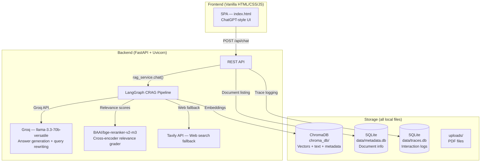
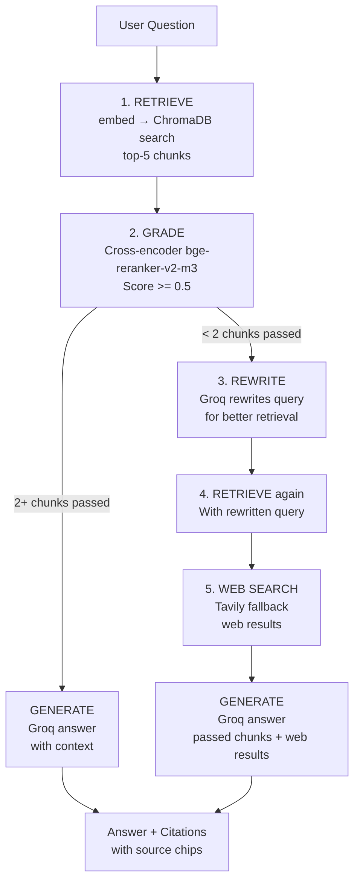

# DocuTrust — Architecture Deep Dive

## Overview

DocuTrust is a **self-correcting Retrieval-Augmented Generation (RAG)** platform. Upload PDFs, ask questions in natural language, and get answers grounded in your documents with page-level citations.

**Stack:** FastAPI + LangGraph + Groq + ChromaDB + Sentence Transformers  
**Frontend:** Vanilla HTML/CSS/JS (no React, no frameworks)  
**Storage:** Local only — ChromaDB vectors + SQLite metadata on disk  
**Run:** Single command — `bash start.sh`



---

## Pipeline Flow



This flow is implemented as a **LangGraph state machine** in `backend/agents/graph.py`. Every node is a pure function that reads from and writes to a shared `CRAGState` dict.

---

## Storage Layer — What Lives Where

| Storage | Location | Contents | Why |
|---|---|---|---|
| **ChromaDB** | `chroma_db/` folder | Vector embeddings (768-dim) + document text + metadata | Semantic similarity search |
| **SQLite (docs)** | `data/metadata.db` | Document metadata — filename, pages, chunks, upload timestamp | File listing in sidebar |
| **SQLite (traces)** | `data/traces.db` | Interaction logs — each question, answer, client_id, model used | Observability / debugging |

### Why ChromaDB + SQLite instead of MongoDB?

MongoDB was the original plan but was replaced because:

1. **Zero infra** — ChromaDB and SQLite are embedded files. No server to install, no Docker, no connection strings.
2. **One command startup** — `bash start.sh` creates venv, installs deps, starts server. All data is local files.
3. **Portable** — The entire project (code + data) fits in one folder. Copy it anywhere, run `start.sh`, it works.
4. **SQLite for traces** — Interaction logs are append-only, low volume. SQLite handles this perfectly without pymongo dependency.

**The MongoDB code is still present** in `backend/services/metadata_store.py` as a dead code path. If a `MONGO_URI` is set in `.env`, it will use MongoDB instead of SQLite. Without it (the default), both metadata and traces go to SQLite.

### What data looks like

A chunk stored in ChromaDB:
```json
{
  "id": "abc123:0",
  "text": "Section 375 of the Indian Penal Code defines rape as...",
  "embedding": [0.023, -0.145, ...],  // 768 floats
  "metadata": {
    "document_id": "abc123",
    "filename": "IPC_Sections.pdf",
    "page": 5,
    "chunk_index": 0
  }
}
```

A trace row in SQLite:
```
client_id | question            | answer        | chunks_retrieved | model_used | timestamp
a1b2c3    | "What is voyeurism?" | "Section 354C..." | 5            | groq-crag  | 2026-07-01...
```

---

## Services — What Does What

### `backend/services/embedding_service.py`
- **Model:** `sentence-transformers/all-MiniLM-L6-v2`
- **Loads once** (singleton via `@lru_cache`)
- **What it does:** Converts text → 768-dim normalized vectors
- **Called by:** `PDF ingestion` (chunks → vectors for ChromaDB storage), `retriever node` (question → vector for search)

### `backend/services/vector_store.py`
- **Backend:** ChromaDB `PersistentClient` (also cached as singleton)
- **Collection:** `docutrust_documents` with cosine distance
- **What it does:** `add_chunks()` stores vectors + text + metadata; `search()` finds nearest neighbors by cosine similarity
- **Score conversion:** ChromaDB returns L2 distance → converts to `1 - distance` so 1.0 = perfect match

### `backend/services/pdf_service.py`
- **Library:** PyMuPDF (`fitz`)
- **What it does:** Opens PDF, iterates pages, extracts text via `page.get_text("text")`
- **Output:** `list[(page_number, text)]`

### `backend/utils/text_splitter.py`
- **Strategy:** `RecursiveCharacterTextSplitter` with `chunk_size=900`, `chunk_overlap=180`
- Applied **per-page**, so chunk boundaries don't cross pages (citations stay accurate)

### `backend/services/llm_service.py`
- **Provider:** Groq API (`groq` SDK)
- **Model:** `llama-3.3-70b-versatile`
- **Prompt:** System prompt + context chunks with filenames + question
- **Fallback:** If no `GROQ_API_KEY` is set, returns a placeholder saying the API key is missing, along with the most relevant chunk text

### `backend/services/metadata_store.py`
- Single class that handles both document metadata and trace logs
- Tries MongoDB first; if `MONGO_URI` is not set or unreachable, falls back to SQLite (two tables in separate files)

### `backend/services/rag_service.py`
- The **orchestrator** — exposes three public methods:
  - `ingest_pdf()` — save file → extract pages → split into chunks → embed → store in ChromaDB → record in metadata store
  - `chat()` — call CRAG pipeline → build citations → save trace log → return `ChatResponse`
  - `documents()` — list all indexed documents from metadata store

---

## Agents — The CRAG Pipeline

Each agent is a node in the LangGraph. They live in `backend/agents/`.

| Agent | File | What it does |
|---|---|---|
| **retriever** | `graph.py:_retrieve` | Embeds question, searches ChromaDB, returns top-5 chunks |
| **grader** | `grader.py` | Cross-encoder reranks chunks; splits into `passed` (score ≥ 0.5) and `failed` |
| **rewriter** | `rewriter.py` | When ≥ 3 chunks fail the grade, Groq rewrites the query to be more specific |
| **web_search** | `web_search.py` | If retry also fails, Tavily API fetches web results as fallback |
| **generator** | `graph.py:_generate` | Groq answers using passed chunks + web results as context; builds citation objects |

### The Routing Decision

After `grade`, `_decide_after_grade` picks the next node:

```
passed >= 2  ──→  generate   (enough context, answer now)
passed < 2   ──→  rewrite    (retry with better query)
retried already ──→  web_search (still not enough, fall back to web)
```

This is the "self-correcting" part of CRAG (Corrective RAG).

---

## API Endpoints

| Method | Path | What it does |
|---|---|---|
| `GET` | `/` | Serves the SPA frontend |
| `GET` | `/health` | Health check |
| `POST` | `/api/upload` | Upload + index a PDF |
| `GET` | `/api/documents` | List indexed documents |
| `POST` | `/api/chat` | Ask a question (GET response with citations) |
| `POST` | `/api/chat/stream` | SSE streaming version (step-by-step progress) |

### Chat Response Format

```json
{
  "answer": "According to the Indian Penal Code, voyeurism is defined under Section 354C...",
  "citations": [
    {
      "document_id": "abc123",
      "filename": "IPC_Sections.pdf",
      "page": 5,
      "chunk_id": "abc123:3",
      "score": 0.87,
      "excerpt": "Section 354C. Voyeurism. — Any man who watches...",
      "url": ""
    },
    {
      "filename": "web: Indian Penal Code overview",
      "page": 0,
      "score": null,
      "excerpt": "The IPC is the official criminal code of India...",
      "url": "https://en.wikipedia.org/wiki/Indian_Penal_Code"
    }
  ],
  "client_id": "a1b2c3d4e5f6",
  "debug": {
    "retrieved_chunks": 5,
    "llm": "groq-crag",
    "steps": [
      {"agent": "retriever", "status": "done", "detail": "Retrieved 5 chunks from vector store"},
      {"agent": "grader", "status": "done", "detail": "3/5 chunks passed relevance threshold"},
      {"agent": "generator", "status": "done", "detail": "Generated answer from 3 context items"}
    ]
  }
}
```

- **PDF citations** → red chip, shows filename + page number
- **Web citations** → amber chip, clickable link to source URL
- Both have the `url` field; web sources get an external link icon

---

## Frontend

### Structure

```
frontend/
  templates/index.html       — Single HTML page (260px sidebar + centered chat)
  static/css/styles.css      — All styles, white ChatGPT-like theme
  static/js/app.js           — All client logic (upload, chat, progress card)
```

### Key UI Components

- **Sidebar:** Upload drop zone, document list with red file icons, CRAG status badge
- **Chat area:** Centered 760px container, bot SVG avatar, user bubbles right-aligned
- **Progress card:** Inline card showing CRAG pipeline steps (spinner → checkmark → "CRAG Pipeline Complete")
- **Source chips:** Red = PDF (filename + page), Amber = Web (clickable link)

### How chat works (non-streaming)

1. User types question → `POST /api/chat` with `{question, top_k: 5}`
2. Loader appears (three bouncing dots)
3. Progress card appears (pulsating green dot, "CRAG Pipeline Running")
4. Response arrives → all steps populate at once with checkmarks
5. Card header changes to "CRAG Pipeline Complete" (static green dot)
6. Answer renders with source chips below

---

## Why These Choices?

| Decision | Why |
|---|---|
| **Groq over Ollama** | Zero local compute, free tier, 1-hour swap. Avoids needing a GPU. |
| **Groq SDK over OpenAI SDK** | Python 3.14 incompatible with `openai` v1.55.0 (`proxies` keyword). `groq` v1.5.0 works cleanly. |
| **LangGraph** | Declarative state machine. Each node is a plain function. Adds routing logic (grade → rewrite → web_search) without spaghetti code. |
| **Cross-encoder grader** | BAAI/bge-reranker-v2-m3 is more accurate than cosine similarity for relevance filtering. Cached once at startup. |
| **ChromaDB (not FAISS)** | Embedded, durable (persists to disk), simple API. FAISS would also work but ChromaDB adds metadata filtering. |
| **No React** | Vanilla HTML/CSS/JS keeps it simple — no build step, no npm, no node_modules. The UI is a single page with minimal interactivity. |
| **Single command startup** | `start.sh` creates venv, installs deps, starts server. Designed for demo/onboarding in one step. |

---

## Environment Variables (`.env`)

```env
ENVIRONMENT=development

# LLM
GROQ_API_KEY=gsk_...           # Required for answer generation + query rewriting
GROQ_MODEL=llama-3.3-70b-versatile

# Web Search Fallback
TAVILY_API_KEY=tvly-...         # Required for web search fallback

# HuggingFace (for cross-encoder, optional)
HF_TOKEN=hf_...                 # Only needed for gated models

# MongoDB (optional - falls back to SQLite)
MONGO_URI=
MONGO_DATABASE=docutrust
```

---

## Files Reference

| File | Purpose |
|---|---|
| `start.sh` | Single-command runner |
| `backend/main.py` | FastAPI app, CORS, static mount, lifespan |
| `backend/config.py` | All settings via pydantic-settings |
| `backend/services/rag_service.py` | Orchestrator — upload + chat + doc listing |
| `backend/services/llm_service.py` | Groq answer generation |
| `backend/services/embedding_service.py` | Sentence-transformers embeddings |
| `backend/services/vector_store.py` | ChromaDB persistence + search |
| `backend/services/pdf_service.py` | PyMuPDF text extraction |
| `backend/services/metadata_store.py` | MongoDB (optional) / SQLite metadata + traces |
| `backend/agents/graph.py` | LangGraph CRAG pipeline definition |
| `backend/agents/grader.py` | Cross-encoder relevance grader |
| `backend/agents/rewriter.py` | Groq-based query rewriting |
| `backend/agents/web_search.py` | Tavily web search |
| `backend/routers/chat.py` | Chat endpoints (normal + SSE stream) |
| `backend/routers/upload.py` | Upload + document listing endpoints |
| `backend/models/schemas.py` | Pydantic request/response models |
| `backend/utils/text_splitter.py` | RecursiveCharacterTextSplitter |
| `backend/utils/file_utils.py` | Filename sanitization + PDF validation |
| `frontend/templates/index.html` | SPA HTML |
| `frontend/static/css/styles.css` | All styles |
| `frontend/static/js/app.js` | All client logic |
| `.env.example` | Template for `.env` |
| `requirements.txt` | Python dependencies |
