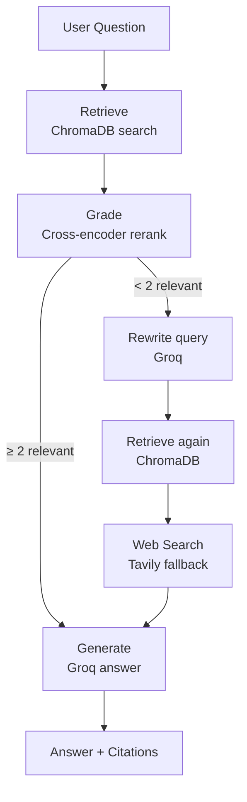
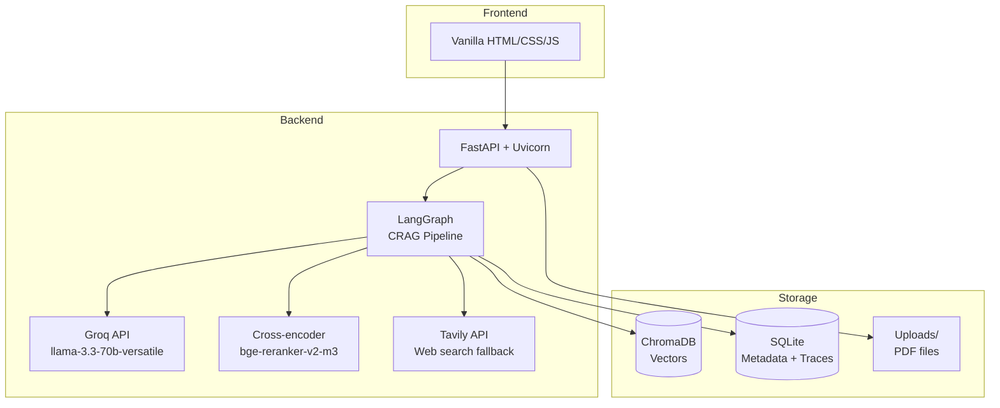

# DocuTrust — Enterprise Advanced RAG Platform

A **self-correcting RAG** platform: upload PDFs, ask questions, get answers with page-level citations. Built with FastAPI, LangGraph, Groq, ChromaDB, and Sentence Transformers. Runs locally with a single command — no Docker, no cloud infra.

## Quick Start

```bash
bash start.sh
# Opens at http://127.0.0.1:8000
```

Prerequisites: Python 3.11+, `GROQ_API_KEY` and `TAVILY_API_KEY` in `.env`.

## How It Works



When too few chunks pass the relevance threshold (score < 0.5), the pipeline automatically rewrites the query, retries retrieval, and falls back to web search — that's the "self-correcting" part.

## Architecture

| Component | Technology | Role |
|---|---|---|
| Web server | FastAPI + Uvicorn | REST API + static file serving |
| Vector DB | ChromaDB (persistent, on-disk) | Stores chunk embeddings for semantic search |
| Metadata | SQLite (`metadata.db`, `traces.db`) | Document info + interaction trace logs |
| Embeddings | `sentence-transformers/all-MiniLM-L6-v2` | Text → 768-dim vectors |
| LLM | Groq (`llama-3.3-70b-versatile`) | Answer generation + query rewriting |
| Relevance grader | `BAAI/bge-reranker-v2-m3` CrossEncoder | Reranks chunks, filters ≥ 0.5 |
| Web fallback | Tavily API | Web search when document context is insufficient |
| Pipeline | LangGraph | State machine orchestrating retriever → grader → rewriter → web_search → generator |
| Frontend | Vanilla HTML/CSS/JS | White ChatGPT-style UI with progress card + source chips |



All storage is local files — delete the project folder to wipe everything.

## Endpoints

| Method | Path | Description |
|---|---|---|
| `GET` | `/` | SPA frontend |
| `GET` | `/health` | Health check |
| `POST` | `/api/upload` | Upload and index a PDF |
| `GET` | `/api/documents` | List indexed documents |
| `POST` | `/api/chat` | Ask a question |

## Setup Manually

```bash
python3 -m venv .venv && source .venv/bin/activate && pip install -r requirements.txt
cp .env.example .env   # Fill in GROQ_API_KEY, TAVILY_API_KEY
uvicorn backend.main:app --reload
```

## Project Structure

```
backend/
  main.py              — FastAPI app entry point
  config.py            — Settings via pydantic-settings
  routers/             — Health, upload, chat endpoints
  services/            — Embedding, vector store, PDF, LLM, RAG orchestrator
  agents/              — LangGraph CRAG pipeline nodes
  models/              — Pydantic schemas
  utils/               — Text splitter, file validation
frontend/
  templates/           — index.html (SPA)
  static/css/          — styles.css
  static/js/           — app.js
chroma_db/             — Vector persistence (auto-created)
data/                  — SQLite databases (auto-created)
uploads/               — Uploaded PDF files
```

## Key Decisions

- **Groq over Ollama** — zero local compute, free tier. Model: `llama-3.3-70b-versatile`
- **Groq SDK over OpenAI SDK** — Python 3.14 incompatibility with `openai` v1.55.0
- **SQLite over MongoDB** — zero infra. Mongo code still present as optional path if `MONGO_URI` is set
- **No Docker, no React** — single `.venv`, one HTML page, no build step

## Environment Variables

```
GROQ_API_KEY=gsk_...    # Required
GROQ_MODEL=llama-3.3-70b-versatile
TAVILY_API_KEY=tvly-... # Required for web search fallback
HF_TOKEN=hf_...         # Optional, for gated HuggingFace models
MONGO_URI=              # Optional — falls back to SQLite
```

For full details, see [ARCHITECTURE.md](ARCHITECTURE.md).
